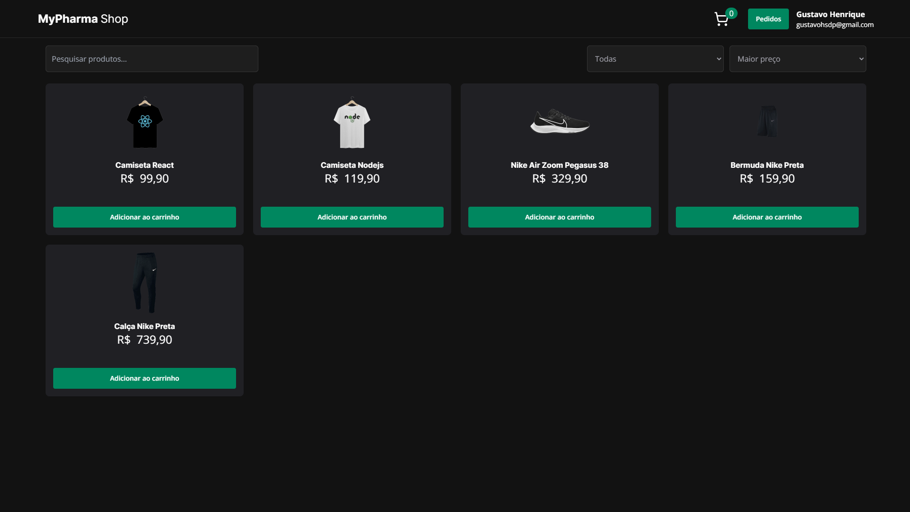
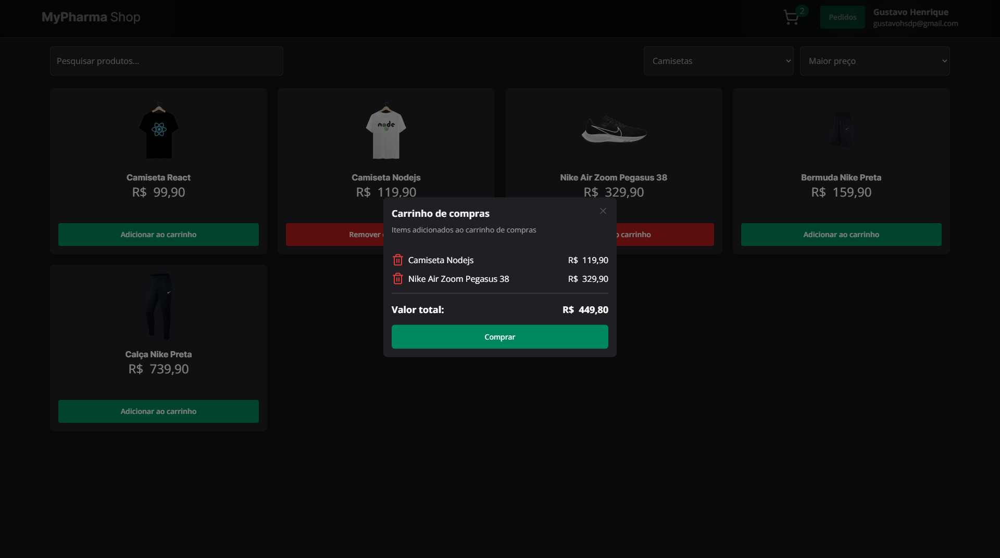
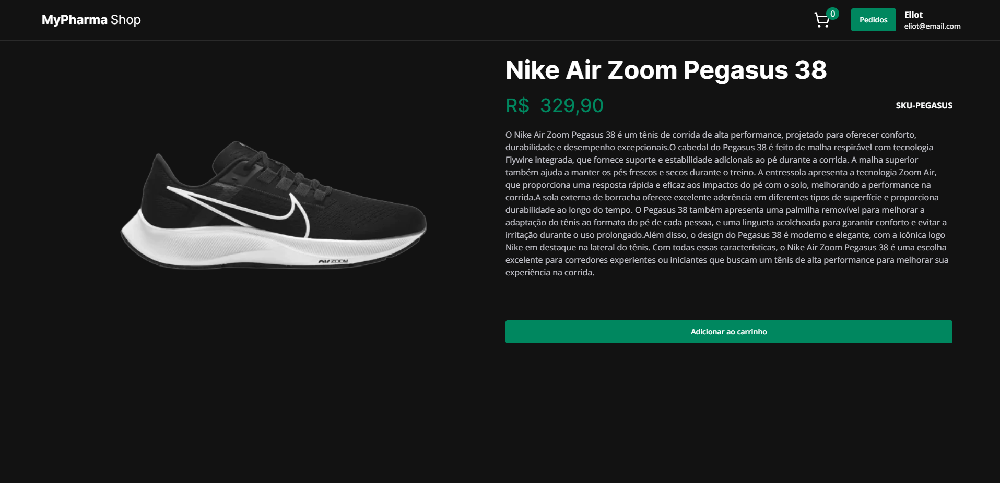

# Mypharma technical test

<p align="center">
  
  
  
</p>

## 🔖 Project

Application to make purchases of products, you can add products to your shopping cart and then complete the purchase. Application has customer order history and order details screen.

Application was built using the technologies below, and the deployment was performed in vercel.

## 🚀 Techs & Tools

→ [**TypeScript**](https://www.typescriptlang.org)
→ [**NextJs**](https://nextjs.org/)
→ [**React Hook Form**](https://react-hook-form.com/)
→ [**Tailwind**](https://tailwindui.com/)

## Setup

Create an `.env` file:

```sh
$ cp .env.example .env
```

Edit this file and set the values for the requested environment variables, example:

```ts
NEXT_PUBLIC_HOST_API = 'api url';
```

## Run app

```sh
$ pnpm install
```

```sh
$ pnpm run dev
```

## Build app

```sh
$ pnpm run build
```
